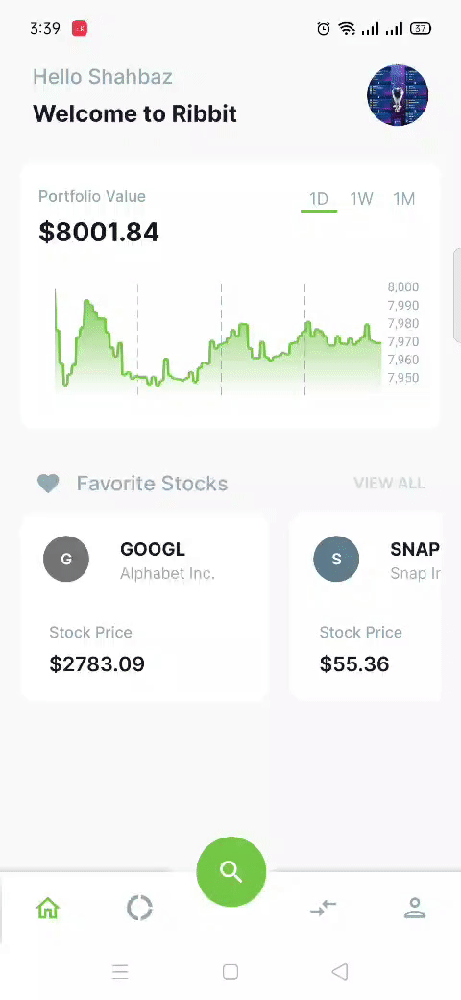

# Ribbit Reference Implementation (Android)
The reference implementation for designing the Android user interface of a broker-dealer trading application with the Alpaca [Broker API](https://alpaca.markets/docs/broker/). The Android user interface is implemented using Java. 

To read more about what Ribbit is, it’s use cases, how it works with Broker API, and more check out our [Ribbit documentation](https://alpaca.markets/docs/broker/ribbit/). 

You can also access the [Ribbit Reference Implementation (Backend)](https://github.com/alpacahq/ribbit-backend) and [Ribbit Reference Implementation (iOS)](https://github.com/alpacahq/ribbit-ios) for a reference implementation of Ribbit’s backend and iOS user interface.

## Caveat
This code is provided as open source for the purpose of demonstration of the Broker API usage. It is not designed for production use and Alpaca does not offer official support of the code available in this repository.

## Overview
This application uses KYC for user verification and grants users from anywhere access to the U.S. Stock Market. 
See below for a quick walkthrough of the app.

## Development setup
To run this project it requires Android Studio version 3.6 or higher. The latest version can be downloaded from [here](https://developer.android.com/studio).

This project uses the Gradle build system:
- Let project run with gradle sync files.
- It should not take long to download required files.
- For more resources on learning Android development, visit the [Developer Guides](https://developer.android.com/guide/).

### Download / Clone Project
---
1. Simply go to repository url on top right side click **code**
and download as zip.
2. Similarly you will find an option for clone project with **HTTPS** and **GitHub CLI** .

For more information on how to clone repositories click [here](https://docs.github.com/en/repositories/creating-and-managing-repositories/cloning-a-repository).
